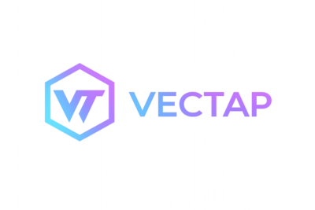

<div align="center">
  
  <p>
    <strong>CLI for streaming events from Vector GraphQL tap endpoints.</strong>
  </p>
</div>

---
# vectap
[](https://github.com/grepplabs/vectap/actions/workflows/build.yml)
[](https://github.com/grepplabs/vectap/releases)

`vectap` is a CLI for streaming events from [Vector](https://vector.dev/) GraphQL tap endpoints. It can
connect directly to one or more Vector API URLs, or discover Vector pods in
Kubernetes, port-forward to them, and merge their tap output into one stream.

It is designed to:

- discover Vector pods in Kubernetes
- port-forward to each pod automatically
- connect to each Vector GraphQL endpoint
- subscribe to tap event streams
- merge streams into one terminal view

## Modes

- `direct`: connect to one or more explicit Vector GraphQL endpoints with `--direct-url`
- `kubernetes`: discover matching pods with `--namespace` and `--selector`, then port-forward to each target automatically
- `config`: load multiple named sources from `vectap.yaml` and run them with `--source` or `--all-sources`

## Quick start

Direct endpoint:

```bash
go mod tidy
go test ./...
go run ./cmd/vectap tap --type direct --direct-url http://127.0.0.1:8686/graphql
```

Kubernetes discovery:

```bash
go run ./cmd/vectap tap --type kubernetes -n observability -l app=vector
go run ./cmd/vectap version
```

## Examples

### Direct endpoint

```bash
vectap tap --type direct --direct-url http://127.0.0.1:8686/graphql
vectap tap --type direct --direct-url http://127.0.0.1:8686/graphql --format json
vectap tap --type direct --direct-url http://127.0.0.1:8686/graphql --duration 30s
```

### Kubernetes discovery

```bash
vectap tap --type kubernetes -n observability -l app=vector
vectap tap --type kubernetes -n observability -l app=vector --outputs-of source.my_logs
vectap tap --type kubernetes -n observability --kubeconfig ~/.kube/config --context kind-dev
vectap tap --type kubernetes -n observability -l app=vector --duration 2m
```

### Config file

Run multiple configured sources from YAML:

```yaml
defaults:
  type: kubernetes
  cluster:
    kubeconfig: ""
    context: ""
  discovery:
    namespace: default
    selector: app.kubernetes.io/name=vector
  transport:
    vector_port: 8686
duration: 30s
sources:
  - name: eu-prod
    type: kubernetes
    cluster:
      kubeconfig: /home/user/.kube/prod.yaml
      context: prod-eu
    discovery:
      namespace: telemetry-routing-engine-eu
      selector: app=vector
    transport:
      vector_port: 8686
    outputs_of:
      - telemetry-*
    local_filters:
      - +component.kind:transform
  - name: local
    type: direct
    apply_defaults: false
    endpoint:
      url: http://127.0.0.1:8686/graphql
    outputs_of:
      - source.my_logs
    inputs_of:
      - sink.prom_exporter
    local_filters:
      - +component.kind:sink
```

```bash
vectap --config vectap.yaml tap --all-sources
vectap --config vectap.yaml tap --source eu-prod --source local
```

## Filtering

## Sampling controls

`vectap tap` uses:

- `--interval` to set the server-side sampling interval in milliseconds
- `--limit` to set the maximum number of events per interval
- `-d, --duration` to stop the whole tap session automatically after a Go duration such as `30s`, `5m`, or `1h15m`

`duration` is global only. It applies once at the start of the tap operation, wraps the input context for the whole session, and is shared by all configured sources. Source configs do not override it.

Examples:

```bash
vectap tap --type direct --direct-url http://127.0.0.1:8686/graphql --interval 500 --limit 100 --duration 45s
vectap tap --type kubernetes -n observability -l app=vector --outputs-of source.my_logs --duration 2m30s
```

### Match reference

`--outputs-of` / `--inputs-of` scope the server-side tap subscription by component IDs (glob patterns supported). Use `--local-filter` for local filtering of streamed events.

| Flags | Matches |
| --- | --- |
| `--outputs-of` | components (sources, transforms) IDs whose outputs to observe |
| `--inputs-of` | components (transforms, sinks) IDs whose inputs to observe |
| `--local-filter` | local include/exclude rules on component fields and payload tags |

When running configured sources (`--source` / `--all-sources`), each source can also set:

- `outputs_of`
- `inputs_of`
- `local_filters`
- `apply_defaults` (default: `true`)

With `apply_defaults: true`, source-level values are appended to top-level defaults (CLI/env/top-level config). With `apply_defaults: false`, only source-level values are used for that source.

### `--local-filter` grammar

Repeatable rule syntax:

- glob match: `<+|-><field>:<glob>`
- regex match: `<+|->re:<field>:<regex>`
- if `<+|->` is omitted, include (`+`) is assumed

Operators:

- `+` include
- `-` exclude

Supported fields:

- `component.type`
- `component.kind`
- `name`
- `tags.component_id`
- `tags.component_kind`
- `tags.component_type`
- `tags.host`

Examples:

```bash
--local-filter '+component.type:prometheus_*'
--local-filter '-component.kind:source'
--local-filter 're:name:^component_.*$'
--local-filter '-re:tags.component_id:^debug-.*$'
```

### Component scope

Use `--outputs-of` to scope the stream:

```bash
# single component
vectap tap --type kubernetes -n observability -l app=vector --outputs-of source.my_logs

# multiple components
vectap tap --type kubernetes -n observability -l app=vector --outputs-of source.my_logs,transform.route_logs

# glob pattern
vectap tap --type kubernetes -n observability -l app=vector --outputs-of 'telemetry-*'
```

Observe inputs of downstream components:

```bash
vectap tap --type kubernetes -n observability -l app=vector --inputs-of sink.prom_exporter
```

If your target value lives in payload tags (for example `message.tags.component_id` equals `destination-*`), use local filters instead:

```bash
vectap tap --type kubernetes -n observability -l app=vector --local-filter '+tags.component_id:destination-*'
vectap tap --type kubernetes -n observability -l app=vector --local-filter '+re:tags.component_id:^destination-.*$'
```

Optional include/exclude filters by Vector fields:

```bash
# componentType (glob)
vectap tap --type kubernetes -n observability -l app=vector --local-filter '+component.type:prometheus_*' --local-filter '-component.type:console'

# componentKind (glob)
vectap tap --type kubernetes -n observability -l app=vector --local-filter '+component.kind:sink' --local-filter '-component.kind:source'

# componentType/componentKind (regex)
vectap tap --type kubernetes -n observability -l app=vector \
  --local-filter '+re:component.type:^aws_.*' --local-filter '-re:component.type:^console$' \
  --local-filter '+re:component.kind:^sink$' --local-filter '-re:component.kind:^source$'
```

Filter by nested payload tag `tags.component_id` using regex:

```bash
# exclude specific payload tag component IDs
vectap tap --type kubernetes -n observability -l app=vector --local-filter '-re:tags.component_id:^prom_exporter$'

# include only matching payload tag component IDs
vectap tap --type kubernetes -n observability -l app=vector --local-filter '+re:tags.component_id:^destination-.*'
```

### Payload filters

Filter by payload tags (glob + regex):

```bash
vectap tap --type kubernetes -n observability -l app=vector \
  --local-filter '+tags.component_id:destination-*' --local-filter '-tags.component_id:debug-*' \
  --local-filter '+re:tags.component_id:^destination-.*' --local-filter '-re:tags.component_id:^prom_.*$' \
  --local-filter '+tags.component_kind:sink' --local-filter '-tags.component_kind:source' \
  --local-filter '+tags.component_type:aws_*' --local-filter '-tags.component_type:console' \
  --local-filter '+tags.host:vector-*' --local-filter '-tags.host:vector-9'
```

Filter by payload `name` (glob + regex):

```bash
vectap tap --type kubernetes -n observability -l app=vector \
  --local-filter '+name:component_*' --local-filter '-name:adaptive_*' \
  --local-filter '+re:name:^component_.*' --local-filter '-re:name:^adaptive_.*'
```

## Output and environment

### JSON output

```bash
vectap tap --type kubernetes -n observability -l app=vector --format json
```

### Version

```bash
vectap version
```

### Configure through environment variables

Configuration is wired through Cobra + Viper and also supports `VECTAP_` environment variables
for all tap flags (for example `VECTAP_NAMESPACE`, `VECTAP_SELECTOR`, and
`VECTAP_INCLUDE_META`, `VECTAP_INTERVAL`, `VECTAP_LIMIT`, and `VECTAP_DURATION`).

```bash
VECTAP_TYPE=kubernetes VECTAP_NAMESPACE=observability VECTAP_SELECTOR=app=vector vectap tap
VECTAP_DURATION=90s vectap tap --type direct --direct-url http://127.0.0.1:8686/graphql
```

## Real-world example

Use the exact namespace/component from your stream:

```bash
vectap tap \
  --type kubernetes \
  --namespace telemetry-routing-engine-6ecb588d-3413-44ff-a314-ff4db7b49ca8 \
  --outputs-of destination-ea3f37ba-6d79-407a-9570-73eff93b47af-bouncer
```

Filter by tenant ID from the event payload:

```bash
vectap tap \
  --type kubernetes \
  --namespace telemetry-routing-engine-6ecb588d-3413-44ff-a314-ff4db7b49ca8 \
  --outputs-of destination-ea3f37ba-6d79-407a-9570-73eff93b47af-bouncer \
  --format json | jq -r 'select(.message | fromjson? | .["X-Tenant-ID"]=="5ab249fa-d51f-4adf-b41d-bf6d58af115c")'
```

Extract key fields (tenant/service/region/http path/log ID):

```bash
vectap tap \
  --type kubernetes \
  --namespace telemetry-routing-engine-6ecb588d-3413-44ff-a314-ff4db7b49ca8 \
  --outputs-of destination-ea3f37ba-6d79-407a-9570-73eff93b47af-bouncer \
  --format json | jq -r '
  .message
  | fromjson?
  | {
      tenant: .["X-Tenant-ID"],
      service: .tlmr_attributes.resource["service.name"],
      region: .tlmr_attributes.resource["cloud.region"],
      method: .tlmr_attributes.logRecord["http.request.method"],
      path: .tlmr_attributes.logRecord["url.path"],
      log_id: .tlmr_attributes.logRecord["stackit.log.id"]
    }'
```

Run with named sources from config:

```bash
./vectap --config examples/vectap-tlmr.yaml tap --source th-cons-d01,tr-cons-d01
./vectap --config examples/vectap-tlmr.yaml tap --all-sources
```
